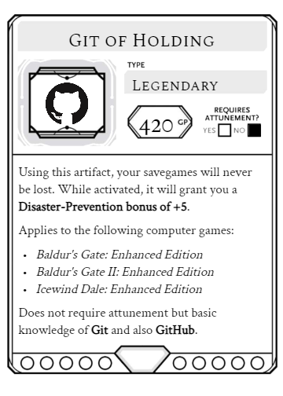

# GitOfHolding - Backup savegames from old D&D computer games

TL;DR: A complete description on how this works would be too long, therefore take a look at the
actual D&D item shown down below:

## Usage:

Fork this repository on GitHub (it includes only my savegames) and clone it locally using Git. Then
follow these steps:

- play the game and save
- run the *GitOfHolding.py* script using Python 3.10+
- commit & push the new changes
